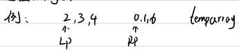
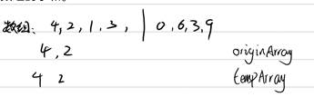
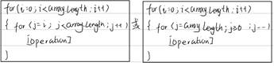

# [归并排序及其面试题](https://www.bilibili.com/video/BV1sovaemESv)

归并排序(递归方式)

1. 求出数组的中点m，并将数组分为左右两侧，直到细分到子数组的LeftEdge = RightEdge
2. 使数组的左侧有序
3. 使数组的右侧有序
4. 当左右两侧有序的数据合并为更大的有序序列，这样的过程是不发生回退的

时间复杂度$O(n\times\log_{2}{n})$，master公式：$T(N)=2\times T(\frac n 2) + O(n)$

合并过程(merge)

先复制两侧数组中叫小一侧的数据，复制后将指针后移，如遇到两侧数字相同时先复制左侧，知道两侧复制完成。之后将tempArray中的数据复制到原始数组的leftArray.Left位置到rightArray.Right位置之间

归并排序(迭代方式)

定义一个初始步长为1，将相邻两个步长之间的数据在临时数组中排序、合并、还原。每趟将步长变为原来的两倍，当剩下的数据不足填满一个步长作为左组时，放弃本轮，进入下一轮排序。当步长找过原来数组的长度时排序结束

小和问题

题目：在一个数组中，每一个数左边比当前小的数的累加和叫做这个数的小和。求一个数组的小和。

流程

1. 求出数组的中点m，并将数组分为左右两侧，直到细分到子数组的LeftEdge = RightEdge
2. 先复制两侧中较小的数组到tempArray中，复制后将指针后移。如果两侧数组当前指针指向的数字相同，先复制右侧数组中的数组，以保证统计有多少个比左侧正在比较的数字小于的数量
3. 使数组的左侧有序
4. 使数组的右侧有序
5. 当左右两侧有序的数据合并为更大的有序序列，这样的过程是不发生回退的

也就是说规定左侧数组中的每个数字是本层用来比较的数字，右侧数组中的数字用来统计当前正在比较的数组在当前层级的小和，而这些中间结果会因为归并排序的特性而被上一层级“接续”计算。

在某个层级的小和计算的方法：resultSum＝(rightArray.rightEdge-rightPointer+1)$\times$ leftArray\[LeftPointer\]在其中rightArray.rightEdge-rightPointer+1表示右侧有这么多数字比他大了一次，等式为左侧有多少个数比右侧的比较的数小(小和的定义)

逆序对问题

在数组中的两个数组，如果前一个数字大于后面的数字，则这两个数字组成一组逆序对。输入一个数组，求出这个数据中的逆序对总和。

流程

1. 求出数组的中点下表m，并将数组分为左右两个部分，直到细分到子数组的leftEdge = rightEdge
2. 先复制量测中较小的数字到tempArray的尾部，复制后将指针前移，如果两侧数组当前指针指向的数字相同，先复制右侧的数据。在这期间，两侧数组指针从右向左移动。
3. 使数组的左侧有序
4. 使数组的右侧有序
5. 左右两侧有序的数据合并为更大的有序序列

本体的解法与上题基本相同，关键在于逆序对的概念会被转化为右侧数组中有多少个比左侧待比较的数次小了一次

总结：

这类问题要点在于，将通常可以想到的形如以下三角形形式的遍历问题：

 

转化为可以分为两组，一组中的作为比较的部分，另一组作为被比较的可以分层计算结果并向上传递结果的形式，这样可以利用归并排序性质中的可以利用下层结果来接续计算的形式，从而从归并排序的模板中找到解决问题的办法，以及达到优化算法性能的效果。

 

题目：对于数组中的每个数字num，求num的右侧有多少数字的两倍仍小于num的个数，返回整个数组中这种情况出现的次数。

与前两题的区别：前两题在合并的过程中计算结果，本题需要在合并前计算结果。提示，不回退的关键是让数据保持一定的单调性。

~~~c#

~~~

