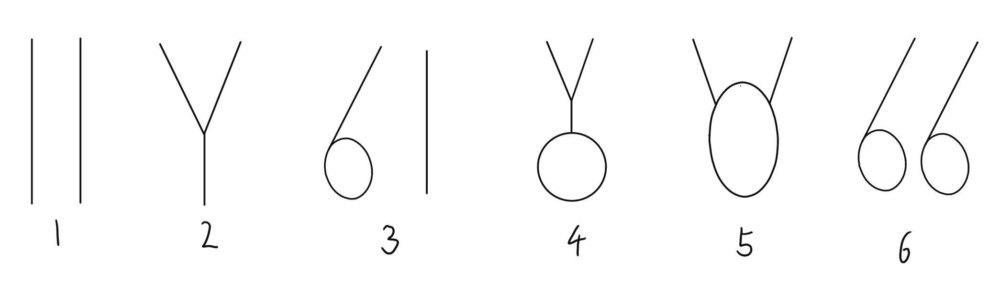

# [排序总结、链表相关题目](https://www.bilibili.com/video/BV1KdvaeEEPU)

**链表**

面试链表问题的解题方法论

1. 对于笔试，不用太在乎空间复杂度，一切为了时间复杂度。
2. 对于面试，时间复杂度依然放在第一位。但是一定要找到空间最省的方法。

## 快慢指针

*  输入链表头节点,奇数长度返回中点,偶数长度返回上中点

~~~ C#
//返回链表中点或者上中点
private static Node? MidOrUpMidNode(Node? head)
{
    if (head?.Next?.Next == null) return head; //如果这个链表的长度小于3那么返回头节点

    var slow = head.Next; //定义慢指针并向后移动一次
    var fast = head.Next.Next; //定义快指针并向后移动一次
    while (fast.Next is { Next: not null })
    {
        //下一个节点和下两个节点不为空
        slow = slow?.Next; //慢指针向后移动
        fast = fast.Next.Next; //快指针向后移动
    }

    return slow;
}
~~~

*  输入链表头节点,奇数长度返回中点,偶数长度返回下中点

~~~ C#
//返回链表中点或者下中点
private static Node? MidOrDownMidNode(Node? head)
{
    if (head?.Next == null) return head; //如果这个链表的长度小于2那么返回头节点

    //要找中点的下一个节点需要定义时向后移一个节点
    var slow = head.Next; //定义慢指针
    var fast = head.Next; //定义快指针
    while (fast.Next is { Next: not null })
    {
        //下一个节点和下两个节点不为空
        slow = slow?.Next; //慢指针向后移动
        fast = fast.Next.Next; //快指针向后移动
    }

    return slow;
}
~~~

*  输入链表头节点,奇数长度返回中点前一个,偶数长度返回上中点前一个

~~~ C#
//返回链表中点或者上中点的上一个节点
private static Node? MidOrUpMidPreNode(Node? head)
{
    if (head?.Next?.Next == null) return null; //如果这个链表的长度小于3那么返回头节点

    //要找中点的上一个节点需要快定义时块指针先走一步
    var slow = head; //定义慢指针
    var fast = head.Next.Next; //定义快指针
    while (fast.Next is { Next: not null })
    {
        //下一个节点和下两个节点不为空
        slow = slow?.Next; //慢指针向后移动
        fast = fast.Next.Next; //块指针向后移动
    }

    return slow;
}
~~~

*  输入链表头节点,奇数长度返回中点前一个,偶数长度返回下中点前一个

~~~ C#
//返回链表中点或者下中点的上一个节点
private static Node? MidOrDownMidPreNode(Node? head)
{
    if (head?.Next == null) return null; //如果这个链表的长度小于2那么返回空

    if (head.Next.Next == null) return head; //如果这个链表的长度小于3那么返回头节点

    //要找中点的下一个节点需要快定义时快指针少走一个节点
    var slow = head; //定义慢指针
    var fast = head.Next; //定义快指针
    while (fast.Next is { Next: not null })
    {
        //下一个节点和下两个节点不为空
        slow = slow?.Next; //慢指针向后移动
        fast = fast.Next.Next; //块指针向后移动
    }

    return slow;
}
~~~

### 常见面试题

题目描述：给定一个单链表的头节点Head，请判断该链表是否为回文结构？ 

* 使用栈（笔试用）

~~~ C#
// 需要O(n)的额外空间
private static bool IsPalindrome1(Node? head)
{
    var stack = new Stack<Node>();
    var current = head;
    //将链表的所有节点放入栈中
    while (current != null)
    {
        stack.Push(current);
        current = current.Next;
    }

    //从头重新遍历链表并同时弹出栈中节点，如果不相同那么不是回文
    while (head != null)
    {
        if (head.Value != stack.Pop().Value) return false;
        head = head.Next;
    }

    return true; //全部相同那么就是回文
}

// 需要O(n/2)的额外空间
private static bool IsPalindrome2(Node? head)
{
    if (head?.Next == null) return true; //链表只有一个节点是回文

    //找到链表的下中点middle
    var middle = head.Next;
    var current = head;
    while (current.Next is { Next: not null })
    {
        middle = middle?.Next;
        current = current.Next.Next;
    }

    //将下中点之后的节点放入栈中
    var stack = new Stack<Node>();
    while (middle != null)
    {
        stack.Push(middle);
        middle = middle.Next;
    }

    //从头重新遍历链表并同时弹出栈中节点，如果不相同那么不是回文
    while (stack.Count != 0)
    {
        if (head?.Value != stack.Pop().Value) return false;
        head = head.Next;
    }

    return true; //链表的前后两部分对称是回文
}
~~~

* 改原链表的方法就需要注意边界了。（面试用）

思路：第一趟遍历将上中点之后的所有节点都指向上一个节点。上中点指向空，第二遍遍历从两侧向中间遍历，直到完成检查。如有需要将右侧更改过的指针朝向恢复。

~~~ C#
// 需要O(1)的额外空间    
public static bool IsPalindrome3(Node? head)
{
    if (head?.Next == null) return true;

    // 找到链表的下中点middle
    var middle = head;
    var current = head;
    while (current.Next is { Next: not null })
    {
        middle = middle?.Next;
        current = current.Next.Next;
    }

    current = middle?.Next; //current指向右半部分的第一个节点 
    var preNode = middle;
    if (middle != null)
    {
        //翻转链表右半部分
        middle.Next = null; //将链表从中间断开 
        while (current != null)
        {
            //右半部分翻转
            var nextNode = current.Next; //记录下个节点 
            current.Next = preNode; //当前节点的Next指向前一个节点
            preNode = current; //上个节点后移
            current = nextNode; //当前节点后移
        }

        var leftHead = head; //获取左侧的头指针
        var rightHead = preNode; //获取右侧的头指针
        var result = true;
        while (leftHead != null && rightHead != null)
        {
            //判断回文
            if (leftHead.Value != rightHead.Value)
            {
                result = false;
                break;
            }

            //两端指针向中间移动
            leftHead = leftHead.Next;
            rightHead = rightHead.Next;
        }

        // 重新连接并恢复后半部分链表的顺序
        var tail = preNode; //右半部分的头节点
        var currentNode = preNode?.Next; //设置右半部分的第二个节点为当前节点
        tail!.Next = null; //将右半部分的头节点设置为空
        while (currentNode != null)
        {
            var nextNode = currentNode.Next; //获取右侧的下一个节点
            currentNode.Next = preNode; //将当前节点的Next指向前一个节点
            preNode = currentNode; //前一个节点后移
            currentNode = nextNode; //当前节点后移
        }

        return result;
    }

    throw new InvalidOperationException();
}
~~~

题目描述：长度相同的两个链表，要求第二个链表翻转后，两链表交错连成一个新的链表，返回新链表的头节点。

~~~ C#
//TODO:这个还没测试过
public ListNode MergeAndReverse(ListNode l1, ListNode l2)
{
    if (l1 == null || l2 == null) return l1 ?? l2;

    // 翻转第二个链表
    ListNode prev = null;
    ListNode current = l2;
    ListNode next = null;
    while (current != null)
    {
        next = current.next;
        current.next = prev;
        prev = current;
        current = next;
    }
    l2 = prev; // 此时l2指向翻转后的链表头

    // 交错连接两个链表
    ListNode dummy = new ListNode(0);
    ListNode tail = dummy;
    bool useL1 = true;
    while (l1 != null && l2 != null)
    {
        if (useL1)
        {
            tail.next = l1;
            l1 = l1.next;
        }
        else
        {
            tail.next = l2;
            l2 = l2.next;
        }
        tail = tail.next;
        useL1 = !useL1; // 交替使用l1和l2
    }

    // 如果链表长度不一致，直接连接剩余部分
    tail.next = l1 ?? l2;

    return dummy.next;
}
~~~

题目描述：将单链表按照某值划分成左边变小、中间相等、右边大的形式。

思路：参考SmallerEqualBigger

* 把链表放入到数组中，在数组上做Partion（笔试）

~~~ C#
private static Node? ListPartition1(Node? head, int target)
{
    if (head == null) return head; //空链表直接返回

    //获得链表的长度
    var current = head;
    var length = 0;
    while (current != null)
    {
        length++;
        current = current.Next;
    }

    //将链表中的节点放到数组中
    var nodeArray = new Node?[length];
    current = head;
    for (length = 0; length != nodeArray.Length; length++)
    {
        nodeArray[length] = current;
        current = current?.Next;
    }

    //对数组进行划分
    ArrayPartition(nodeArray, target);
    //把数组中的节点从左向右重新连接并将最后一个节点的Next设置为null
    for (length = 1; length != nodeArray.Length; length++) nodeArray[length - 1]!.Next = nodeArray[length];
    nodeArray[length - 1]!.Next = null;
    //返回头指针
    return nodeArray[0];
}

private static void ArrayPartition(Node?[] nodeArr, int target)
{
    var small = -1;
    var big = nodeArr.Length;
    var index = 0;
    while (index != big)
    {
        if (nodeArr[index]?.Value < target)
        {
            small++;
            (nodeArr[small], nodeArr[index]) = (nodeArr[index], nodeArr[small]);
            index++;
        }
        else if (nodeArr[index]?.Value == target)
        {
            index++;
        }
        else
        {
            big--;
            (nodeArr[big], nodeArr[index]) = (nodeArr[index], nodeArr[big]);
        }
    }
}
~~~

* 分成大中小三个部分，再把各个部分串起来（面试）

~~~ C#
private static Node? ListPartition2(Node? head, int target)
{
    Node? lessRegionHead = null; //小于区域头指针
    Node? lessRegionTail = null; //小于区域尾指针
    Node? equalRegionHead = null; //等于区域头指针
    Node? equalRegionTail = null; //等于区域尾指针
    Node? greaterRegionHead = null; //大于区域头指针
    Node? greaterRegionTail = null; //大于区域尾指针
    // 将每个节点分配到三个区域中
    var current = head;
    while (current != null)
    {
        var next = current.Next; //保存当前节点的下一个节点
        current.Next = null; //将当前节点的于之后的节点断开
        if (current.Value < target) //小于区域
        {
            if (lessRegionHead == null) //小于区域为空
            {
                //小于区域的头尾指针都指向这个节点
                lessRegionHead = current;
                lessRegionTail = current;
            }
            else
            {
                //在小于区域的尾指针指向的节点后追加这个新节点并更新尾指针
                if (lessRegionTail != null) lessRegionTail.Next = current;
                lessRegionTail = current;
            }
        }
        else if (current.Value == target) //等于区域
        {
            if (equalRegionHead == null) //等于区域为空
            {
                //等于区域的头尾指针都指向这个节点
                equalRegionHead = current;
                equalRegionTail = current;
            }
            else
            {
                //在等于区域的尾指针指向的节点后追加这个新节点并更新尾指针
                if (equalRegionTail != null) equalRegionTail.Next = current;
                equalRegionTail = current;
            }
        }
        else //大于区域
        {
            if (greaterRegionHead == null) //大于区域为空
            {
                //大于区域的头尾指针都指向这个节点
                greaterRegionHead = current;
                greaterRegionTail = current;
            }
            else
            {
                //在大于区域的尾指针指向的节点后追加这个新节点并更新尾指针
                if (greaterRegionTail != null) greaterRegionTail.Next = current;
                greaterRegionTail = current;
            }
        }

        current = next;
    }

    // 小于区域的尾巴，连等于区域的头，等于区域的尾巴连大于区域的头
    if (lessRegionTail != null) // 如果有小于区域
    {
        lessRegionTail.Next = equalRegionHead;
        equalRegionTail ??= lessRegionTail; // 如果没有等于区域，等于区域的尾指针指向小于区域的尾指针
    }

    // 等于区域的尾巴，连大于区域的头
    if (equalRegionTail != null) // 如果小于区域和等于区域，不是都没有
        equalRegionTail.Next = greaterRegionHead;

    //返回小于区域的头，如果没有小于区域，返回等于区域的头，如果没有等于区域，返回大于区域的头
    return lessRegionHead ?? (equalRegionHead ?? greaterRegionHead);
}
~~~

题目描述：一种特殊的单链表节点类描述如下

~~~C#
public class Node
{
	private int _value;
	private Node _next;
	private Node _rand;
	Node(int val){_value = val}
}
~~~

rand指针是单链表节点结构中新增的指针，rand可能指向单链表中的任意一个节点，也可能指向null，给定一个由Node节点类型组成的无环单链表的头节点head，请事先一个函数完成这个链表的复制，请实现一个函数完成这个链表的复制，并返回复制的新链表的的头节点。要求时间复杂度$O(N)$，空间复杂度$O(1)$。
思路：

* 使用Dict\<Node,Node\>，第一遍只是用原链表的next指针进行遍历，遍历时同时创建出复制的节点。第二遍遍历时根据原链表的next和rand的链接关系将复制的节点单链接起来。
* 第一遍遍历在原来节点之间插入复制的节点。第二遍遍历设置与原来相同的next和rand的链接关系。并将与原始链表节点的链接删除。最后返回完成复制的新链表的头节点。

题目描述：给定两个可能有环也可能无环的单链表,头节点head1和head2请实现一个函数,如果两个链表相交,请返回相交的第一个节点。如果不相交,返回null。要求：如果两个链表长度之和为N,时间复杂度请达到$O(N)$,额外空间复杂度请达到$O(1)$。

思路：
* 快慢指针求解
	* 需要找到第一个入环节点
	* 获得入环节点函数：设置快慢两个指针，快指针一次走两个节点，慢指针一次走一个节点；若快指针可以到达null，这说明这个链表是无环的。若链表是有环的，那么快指针可以在环上的某一个节点相遇。相遇之后，慢指针保持不变，快指针返回链表头部，更改为每次走一个节点。快慢指针再次向后移动，则相遇的节点就是入环的第一个节点。(**下方的思考题解释了为什么这样可以找到入环节点**)
	* 判断两链表是否相交函数：分别获得两个链表的末尾节点的地址和链表的长度。如果两个链表的末尾节点地址不相同，则两链表不相交。若末尾节点地址相同，较长的链表先向后移动两链表相差的长度。然后两链表同时向后移动。则两指针第一个同时指向的节点就是两链表相交的节点。
	* 可能出现的所有情况：
	
	* 两个链表都无环(可能相交合能不相交“情况1”和“情况2”)
	* 两链表中有一个是有环的(不可能相交“情况3”)
	* 两个链表都有环(可能相交“情况4”和“情况5”，可能不相交“情况6”)
	

~~~ C#
private static Node? GetIntersectNode(Node? head1, Node? head2)
{
    if (head1 == null || head2 == null) return null;

    //获取两个链表的入环节点
    var loop1 = GetLoopNode(head1);
    var loop2 = GetLoopNode(head2);
    //如果两个链表的入伙节点一致，按照两链表相交并无环的请情况处理
    if (loop1 == null && loop2 == null) return NoLoop(head1, head2);

    //如果两个链表都有入环节点，按照两链表相交有环的请情况处理
    if (loop1 != null && loop2 != null) return BothLoop(head1, loop1, head2, loop2);

    //如果两个链表一个有入环节点，一个没有入环节点，则两链表不相交
    return null;
}

// 找到链表的入环节点，如果无环，返回null。关于这个函数的原理，笔记EP09中有说明
private static Node? GetLoopNode(Node? head)
{
    if (head?.Next?.Next == null) return null;

    var slow = head.Next;
    var fast = head.Next.Next;
    while (slow != fast)
    {
        if (fast.Next?.Next == null) return null;

        fast = fast.Next.Next;
        slow = slow?.Next;
    }

    fast = head;
    while (slow != fast)
    {
        slow = slow?.Next;
        fast = fast?.Next;
    }

    return slow;
}

// 如果两个链表都无环，返回第一个相交节点，如果不想交，返回null
private static Node? NoLoop(Node? head1, Node? head2)
{
    if (head1 == null || head2 == null) return null;

    var cur1 = head1;
    var cur2 = head2;
    var lengthGap = 0;
    while (cur1.Next != null)
    {
        lengthGap++;
        cur1 = cur1.Next;
    }

    while (cur2.Next != null)
    {
        lengthGap--;
        cur2 = cur2.Next;
    }

    if (cur1 != cur2) return null;

    cur1 = lengthGap > 0 ? head1 : head2; // 谁长，谁的头变成cur1
    cur2 = cur1 == head1 ? head2 : head1; // 谁短，谁的头变成cur2
    lengthGap = Math.Abs(lengthGap);
    //让长链表的current指针先走lengthGap步
    while (lengthGap != 0)
    {
        lengthGap--;
        cur1 = cur1?.Next;
    }

    //两个链表current指针同时走，如果相交，则返回第一个相交节点
    while (cur1 != cur2)
    {
        cur1 = cur1?.Next;
        cur2 = cur2?.Next;
    }

    //如果不想交，cur1为null
    return cur1;
}

// 两个有环链表，返回第一个相交节点，如果不想交返回null
private static Node? BothLoop(Node head1, Node loop1, Node head2, Node loop2)
{
    Node? cur1;
    //如果两个入环节点一致，说明此时两链表呈>-O，按照>-处理，只不过他的末尾节点变成了loop1或者loop2
    if (loop1 == loop2)
    {
        cur1 = head1;
        var cur2 = head2;
        var n = 0;
        while (cur1 != loop1)
        {
            n++;
            cur1 = cur1?.Next;
        }

        while (cur2 != loop2)
        {
            n--;
            cur2 = cur2?.Next;
        }

        cur1 = n > 0 ? head1 : head2;
        cur2 = cur1 == head1 ? head2 : head1;
        n = Math.Abs(n);
        while (n != 0)
        {
            n--;
            cur1 = cur1?.Next;
        }

        while (cur1 != cur2)
        {
            cur1 = cur1?.Next;
            cur2 = cur2?.Next;
        }

        return cur1;
    }

    //如果两个入环节点能向后移动遇到另个入环节点，说明此时两链表呈😈(圆上两个触角)
    cur1 = loop1.Next;
    while (cur1 != loop1)
    {
        if (cur1 == loop2) return loop1;

        cur1 = cur1?.Next;
    }

    //两个链表有环但不相交
    return null;
}
~~~~

* 容器求解：使用集合统计

~~~ C#
private static Node? GetIntersectNode(Node? head1, Node? head2)
{
    ISet<Node> visited = new HashSet<Node>();//记录链表A中访问过的节点
    //将访问过的链表放入集合中
    var temp = head1;
    while (temp != null)
    {
        //如果添加了重复的节点说明已经将环上的节点添加完毕，退出循环
        if(!visited.Add(temp)) break;
        temp = temp.Next;
    }

    //遍历链表B，如果B中存在A中访问过的节点，这个节点就是两链表相交时的节点
    temp = head2;
    while (temp != null)
    {
        if (visited.Contains(temp))
        {
            return temp;
        }

        temp = temp.Next;
    }

    return null;
}
~~~~

> 思考题：为什么快慢指针能找到第一个入环的节点？

现在我们有一个确定包含环的单链表，并提供它的头节点指针head。单链表的尾节点的Next指针具体指向了列表中的哪一个节点我们是暂时不知道的。

现在我们规定头节到达环的入口节点的长度为L，环内的节点数为C，入口节点到快慢指针相遇的节点node的距离为X。此时，慢指针从头节点到现在走过的路程为$L+X$。快指针走过的路程是L加上不知道多少圈的环再加上X即$L+n\times C+X$。我们知道快指针的移动速度是慢指针的两倍，所以就有$2\times (L+X)=L+n\times C+X$，化简后得到$L+X=n\times C$​。根据这个化简后的表达式我们可以看出：当前已经从入口节点向后移动了X个节点的慢指针如果再继续向后移动L个节点那么慢指针就走了n圈的环，那么就回到了环的起点。且这个长度L就是头节点到入环节点的距离。所以快指针从头一倍的速度一直向后移动，当前两个节点相遇时，快慢指针指向的节点就是环的入口节点。

> 思考题：对于一个单链表，如果只知道要删除的某个节点，那么应该如何删除这个节点呢？这样做有什么弊端？

对于只知道在单链表上要删除某个节点并完成删除操作，一个不完美的解决方案是用后面节点的值来覆盖前面节点的值。但是这种方法无法完成链表尾节点的删除操作。比如如果链表是带有依赖的某个业务实体，那么通过覆盖方法会因为数据的访问权限和依赖迁移困难导致这种方法并不可行。
