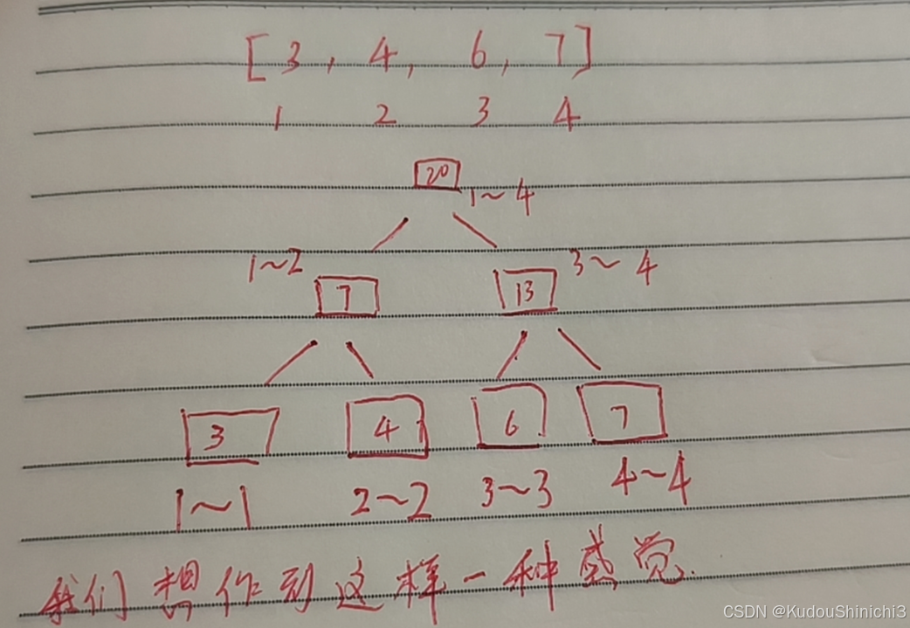
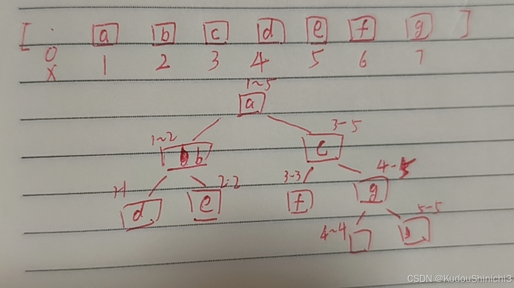
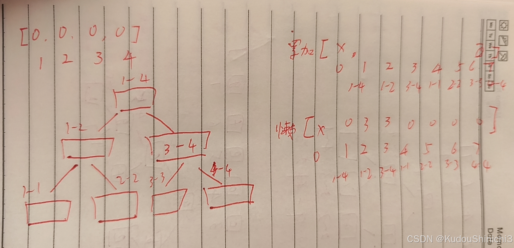
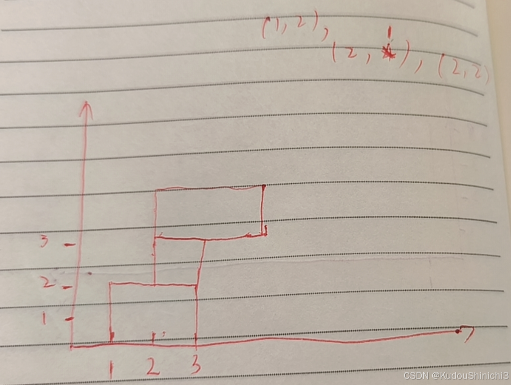

# [线段树](https://www.bilibili.com/video/BV1EuvYezEmY)

1.线段树用来解决什么问题
假如说你有一个数组，数组下标为 0-1000，然后对外提供一些方法，

1.1比如说你对外提供add方法，add方法（1,200,6），请你把从1 到 200 位置所有的值 加上6

1.2更新（update），传递一个范围，比如 （7,375，4） 7-375范围所有值变为4

1.3 query  比如（3,999） 查询3到999所有数据的和是多少。

如果暴力方法我们怎么来做啊，add方法遍历嘛，遍历1-200 每个加一个6，更新和query也一样。

所以说线段树用来解决什么问题，区间上统一增加，区间上统一修改，区间上统一查询累加和。而且还能很快。假如说数组一共N个数，线段树做上述操作，能够达到logN级别。

关于线段树的实现，有非递归方法，但是实现起来非常麻烦，本篇文章提供的是递归方法。那么有同学就担心了，那我在工程上使用会不会出问题啊，这里告诉大家，不会的，为啥呢，因为啊，对于线段树这种结构，哪怕你的 N 是 2的64次方，这个线段树最多往下多少层呢，也就64层，也就是说你虽然写了一个递归函数，但是这个递归函数的深度不会太大的。除非你是给神仙写代码，数据量都超过2的64次方了。那确实有可能出错吧。

一般来说，我们线段树数组的下表都是从 1 开始的。如下图



我们想做到这样一个树状结构的感觉，啥意思呢，就是整个范围，最大的格子兜着，然后它会将自己的范围，几乎一般的分给左右两侧，上述例子中，左孩子负责 1到2  右孩子负责 3-4 ，再把这个范围往下分，就如上图的叶子节点。当然实际实现的时候，是用数组实现的。

假设我有一个足够长的数组，0位置我们弃而不用。



是不是有点像堆的感觉。当然有一些公式同样适用，例如任何一个节点 i 的父节点 为 i/2，同样到底任何一节点i的左孩子为 2*i 位置;右孩子为 2 * i + 1 位置。这样就有一个问题了，数组我到底要准备多长，这里说一个结论，就是如果原数组长度为N的话， 用来存储数结构的数组准备4N绝对够用。

2.懒更新。
我们先说在一个范围上共同累加一个数字 V。

我们假设一个格子表示 1 - 1000 范围上的累加和是多少， 然后请你把 3 - 874 上所有的值加上 5。这个格子左侧范围是多少呢？没错，是 1 - 500，右侧范围呢  是 501 - 1000;你就知道，这个任务，既应该发给左孩子，右应该发给右孩子。为什么既要发给左孩子，又要发给右孩子呢，因为我这个任务没办法单独被左孩子搞定或者单独被右孩子搞定。这里我们先看左边，我们的左孩子就得到这个任务了，它的左孩子是谁，1 - 250，右孩子呢 251 - 500，总任务是啥  3 -  874，然后我们就知道，这个任务既要发给左，又要发给右，但问题是，我发给右侧之后，这个任务是在整个范围中全得做的。此时，右侧我就缓住不发了。这里我们可以再申请一个一样长的数组，用于存放懒更新的信息。我们就在新申请的数组中 表示 251 - 500 位置 的值设置 为 5，表示拦住该信息。它左边应不应该往下发，应该往下发，为啥，你的任务是 3 - 874 ，而你的范围是 1 - 250 ，没办法完全拦住，所以需要往下发，每次来新任务前，需要把旧的任务往下发一层。例如



假如说我来了一个任务，需要在 1 - 4 位置加一个 3 ，我们就把下面 1 位置更新为3，然后又来一个任务，我需要把 1 - 2 位置 加 一个 4 ，任务来之后，我们需要先检查是否有懒任务，有的话就往下发一层，我先检查 1-4 有没有，发现有，这样的话 往下发一层， 2 ，3 位置就都是 3，然后我1位置就能处理了。我发现 任务为 1- 2 位置加一个 4 只用发给左边，然后就往左边发，发时先检查有没有懒任务，发现有，就继续往下发一层，然后把2位置更新为四。所以，最后的数组应该是这样的 [X,0,4,3,3,3,0,0]

Code:

```csharp
public class SegmentTree {
    public static class SegmentTree {
        // arr[]为原序列的信息从0开始，但在arr里是从1开始的
        // sum[]模拟线段树维护区间和
        // lazy[]为累加和懒惰标记
        // change[]为更新的值
        // update[]为更新慵懒标记
        private int MAXN;
        private int[] arr;
        private int[] sum;
        private int[] lazy;
        private int[] change;
        private boolean[] update;

        public SegmentTree(int[] origin) {
            MAXN = origin.length + 1;
            arr = new int[MAXN]; // arr[0] 不用 从1开始使用
            for (int i = 1; i < MAXN; i++) {
                arr[i] = origin[i - 1];
            }
            sum = new int[MAXN << 2]; // 用来支持脑补概念中，某一个范围的累加和信息
            lazy = new int[MAXN << 2]; // 用来支持脑补概念中，某一个范围沒有往下傳遞的纍加任務
            change = new int[MAXN << 2]; // 用来支持脑补概念中，某一个范围有没有更新操作的任务
            update = new boolean[MAXN << 2]; // 用来支持脑补概念中，某一个范围更新任务，更新成了什么
        }

        private void pushUp(int rt) {
            sum[rt] = sum[rt << 1] + sum[rt << 1 | 1];
        }

        // 之前的，所有懒增加，和懒更新，从父范围，发给左右两个子范围
        // 分发策略是什么
        // ln表示左子树元素结点个数，rn表示右子树结点个数
        private void pushDown(int rt, int ln, int rn) {
            if (update[rt]) {
                update[rt << 1] = true;
                update[rt << 1 | 1] = true;
                change[rt << 1] = change[rt];
                change[rt << 1 | 1] = change[rt];
                lazy[rt << 1] = 0;
                lazy[rt << 1 | 1] = 0;
                sum[rt << 1] = change[rt] * ln;
                sum[rt << 1 | 1] = change[rt] * rn;
                update[rt] = false;
            }
            if (lazy[rt] != 0) {
                lazy[rt << 1] += lazy[rt];
                sum[rt << 1] += lazy[rt] * ln;
                lazy[rt << 1 | 1] += lazy[rt];
                sum[rt << 1 | 1] += lazy[rt] * rn;
                lazy[rt] = 0;
            }
        }

        // 在初始化阶段，先把sum数组，填好
        // 在arr[l~r]范围上，去build，1~N，
        // rt : 这个范围在sum中的下标
        public void build(int l, int r, int rt) {
            if (l == r) {
                sum[rt] = arr[l];
                return;
            }
            int mid = (l + r) >> 1;
            build(l, mid, rt << 1);
            build(mid + 1, r, rt << 1 | 1);
            pushUp(rt);
        }
        // L~R  所有的值变成C
        // l~r  rt
        public void update(int L, int R, int C, int l, int r, int rt) {
            if (L <= l && r <= R) {
                update[rt] = true;
                change[rt] = C;
                sum[rt] = C * (r - l + 1);
                lazy[rt] = 0;
                return;
            }
            // 当前任务躲不掉，无法懒更新，要往下发
            int mid = (l + r) >> 1;
            pushDown(rt, mid - l + 1, r - mid);
            if (L <= mid) {
                update(L, R, C, l, mid, rt << 1);
            }
            if (R > mid) {
                update(L, R, C, mid + 1, r, rt << 1 | 1);
            }
            pushUp(rt);
        }

        // L~R, C 任务！
        // rt，l~r
        public void add(int L, int R, int C, int l, int r, int rt) {
            // 任务如果把此时的范围全包了！
            if (L <= l && r <= R) {
                sum[rt] += C * (r - l + 1);
                lazy[rt] += C;
                return;
            }
            // 任务没有把你全包！
            // l  r  mid = (l+r)/2
            int mid = (l + r) >> 1;
            pushDown(rt, mid - l + 1, r - mid);
            // L~R
            if (L <= mid) {
                add(L, R, C, l, mid, rt << 1);
            }
            if (R > mid) {
                add(L, R, C, mid + 1, r, rt << 1 | 1);
            }
            pushUp(rt);
        }

        // 1~6 累加和是多少？ 1~8 rt
        public long query(int L, int R, int l, int r, int rt) {
            if (L <= l && r <= R) {
                return sum[rt];
            }
            int mid = (l + r) >> 1;
            pushDown(rt, mid - l + 1, r - mid);
            long ans = 0;
            if (L <= mid) {
                ans += query(L, R, l, mid, rt << 1);
            }
            if (R > mid) {
                ans += query(L, R, mid + 1, r, rt << 1 | 1);
            }
            return ans;
        }
    }

    public static class Right {
        public int[] arr;public Right(int[] origin) {
            arr = new int[origin.length + 1];
            for (int i = 0; i < origin.length; i++) {
                arr[i + 1] = origin[i];
            }
        }

        public void update(int L, int R, int C) {
            for (int i = L; i <= R; i++) {
                arr[i] = C;
            }
        }

        public void add(int L, int R, int C) {
            for (int i = L; i <= R; i++) {
                arr[i] += C;
            }
        }

        public long query(int L, int R) {
            long ans = 0;
            for (int i = L; i <= R; i++) {
                ans += arr[i];
            }
            return ans;
        }
    }

    public static int[] genarateRandomArray(int len, int max) {
        int size = (int) (Math.random() * len) + 1;
        int[] origin = new int[size];
        for (int i = 0; i < size; i++) {
            origin[i] = (int) (Math.random() * max) - (int) (Math.random() * max);
        }
        return origin;
    }

    public static boolean test() {
        int len = 100;
        int max = 1000;
        int testTimes = 5000;
        int addOrUpdateTimes = 1000;
        int queryTimes = 500;
        for (int i = 0; i < testTimes; i++) {
            int[] origin = genarateRandomArray(len, max);
            SegmentTree seg = new SegmentTree(origin);
            int S = 1;
            int N = origin.length;
            int root = 1;
            seg.build(S, N, root);
            Right rig = new Right(origin);
            for (int j = 0; j < addOrUpdateTimes; j++) {
                int num1 = (int) (Math.random() * N) + 1;
                int num2 = (int) (Math.random() * N) + 1;
                int L = Math.min(num1, num2);
                int R = Math.max(num1, num2);
                int C = (int) (Math.random() * max) - (int) (Math.random() * max);
                if (Math.random() < 0.5) {
                    seg.add(L, R, C, S, N, root);
                    rig.add(L, R, C);
                } else {
                    seg.update(L, R, C, S, N, root);
                    rig.update(L, R, C);
                }
            }
            for (int k = 0; k < queryTimes; k++) {
                int num1 = (int) (Math.random() * N) + 1;
                int num2 = (int) (Math.random() * N) + 1;
                int L = Math.min(num1, num2);
                int R = Math.max(num1, num2);
                long ans1 = seg.query(L, R, S, N, root);
                long ans2 = rig.query(L, R);
                if (ans1 != ans2) {
                    return false;
                }
            }
        }
        return true;
    }
    public static void main(String[] args) {
        int[] origin = { 2, 1, 1, 2, 3, 4, 5 };
        SegmentTree seg = new SegmentTree(origin);
        int S = 1; // 整个区间的开始位置，规定从1开始，不从0开始 -> 固定
        int N = origin.length; // 整个区间的结束位置，规定能到N，不是N-1 -> 固定
        int root = 1; // 整棵树的头节点位置，规定是1，不是0 -> 固定
        int L = 2; // 操作区间的开始位置 -> 可变
        int R = 5; // 操作区间的结束位置 -> 可变
        int C = 4; // 要加的数字或者要更新的数字 -> 可变
        // 区间生成，必须在[S,N]整个范围上build
        seg.build(S, N, root);
        // 区间修改，可以改变L、R和C的值，其他值不可改变
        seg.add(L, R, C, S, N, root);
        // 区间更新，可以改变L、R和C的值，其他值不可改变
        seg.update(L, R, C, S, N, root);
        // 区间查询，可以改变L和R的值，其他值不可改变
        long sum = seg.query(L, R, S, N, root);
        System.out.println(sum);

        System.out.println("对数器测试开始...");
        System.out.println("测试结果 : " + (test() ? "通过" : "未通过"));
    }
}
```

update:

同样我们准备一个update数组，如果我要在 1 - 500 所有范围内变成 7 ，就在update数组中，代表 1 - 500 位置 设置 值为7。那为啥还要有一个 bool 的数组的，因为如果是 0 的话，你不知道是表示没有update信息呢，还是要全部变为 0 呢。其他过程和add差不多。相信大家看代码很容易就能够看明白。这里面着重说一下pushDown方法为啥更新在前累加在后，因为我们更新操作是会把累加给清空的，如果更新数组和累加数组都有值，说明我们的更新操作是在累加之前。所以我们要先执行更新操作。

3.积方块问题
说，在一个X轴上，会落下一个方块，该方块由两个数组成;例如（1,4）代表左边为X坐标为 1，宽和高都是4的一个方块落下，如下图：



 问  当落下一个方块后，最高为多少？

这道题就涉及到线段树的改动了。当一个方块落下之后，再有一个方块落下，我们需要将第二个方块的范围的Max，并把该范围所有值更新为Max，然后再共同加上这个高。比如我这个方块宽度坐标为6-10,这里我们需要把6-10的最大值查询出来，并把6-10的值全部更新为最大值加上高度这个值。这里我们要的不是累加和，而是max ，这里就需要更改我们的线段树了。

```csharp


public class FallingSquares {
    public static class SegmentTree {
        private int[] max;
        private int[] change;
        private boolean[] update;

        public SegmentTree(int size) {
            int N = size + 1;
            max = new int[N << 2];

            change = new int[N << 2];
            update = new boolean[N << 2];
        }

        private void pushUp(int rt) {
            max[rt] = Math.max(max[rt << 1], max[rt << 1 | 1]);
        }

        // ln表示左子树元素结点个数，rn表示右子树结点个数
        private void pushDown(int rt, int ln, int rn) {
            if (update[rt]) {
                update[rt << 1] = true;
                update[rt << 1 | 1] = true;
                change[rt << 1] = change[rt];
                change[rt << 1 | 1] = change[rt];
                max[rt << 1] = change[rt];
                max[rt << 1 | 1] = change[rt];
                update[rt] = false;
            }
        }

        public void update(int L, int R, int C, int l, int r, int rt) {
            if (L <= l && r <= R) {
                update[rt] = true;
                change[rt] = C;
                max[rt] = C;
                return;
            }
            int mid = (l + r) >> 1;
            pushDown(rt, mid - l + 1, r - mid);
            if (L <= mid) {
                update(L, R, C, l, mid, rt << 1);
            }
            if (R > mid) {
                update(L, R, C, mid + 1, r, rt << 1 | 1);
            }
            pushUp(rt);
        }

        public int query(int L, int R, int l, int r, int rt) {
            if (L <= l && r <= R) {
                return max[rt];
            }
            int mid = (l + r) >> 1;
            pushDown(rt, mid - l + 1, r - mid);
            int left = 0;
            int right = 0;
            if (L <= mid) {
                left = query(L, R, l, mid, rt << 1);
            }
            if (R > mid) {
                right = query(L, R, mid + 1, r, rt << 1 | 1);
            }
            return Math.max(left, right);
        }

    }

    public HashMap<Integer, Integer> index(int[][] positions) {
        TreeSet<Integer> pos = new TreeSet<>();
        for (int[] arr : positions) {
            pos.add(arr[0]);
            pos.add(arr[0] + arr[1] - 1);
        }
        HashMap<Integer, Integer> map = new HashMap<>();
        int count = 0;
        for (Integer index : pos) {
            map.put(index, ++count);
        }
        return map;
    }

    public List<Integer> fallingSquares(int[][] positions) {
        HashMap<Integer, Integer> map = index(positions);
        int N = map.size();
        SegmentTree segmentTree = new SegmentTree(N);
        int max = 0;
        List<Integer> res = new ArrayList<>();
        // 每落一个正方形，收集一下，所有东西组成的图像，最高高度是什么
        for (int[] arr : positions) {
            int L = map.get(arr[0]);
            int R = map.get(arr[0] + arr[1] - 1);
            int height = segmentTree.query(L, R, 1, N, 1) + arr[1];
            max = Math.max(max, height);
            res.add(max);
            segmentTree.update(L, R, height, 1, N, 1);
        }
        return res;
    }
}
```

 4.什么问题适合线段树
       我们可以根据左树信息和右树信息直接加工出我的信息的题目，可以用到线段树，有些就不能，例如，一个数组中 求出现最多的数，这个就不可以，假如说我分为两半，左树出现最多的数字为 13 右树出现最多的数是 10，那么出现最多的数一定是  13 或者 10 中的一个吗？

不一定，因为可能有一个数，在左边不是最多的，在右边也不是最多的，但是加起来，却是最多的，所以该情况不可以使用线段树。所以线段树只适合于我可以根据左树和右树，加工出我自己信息的情况。 