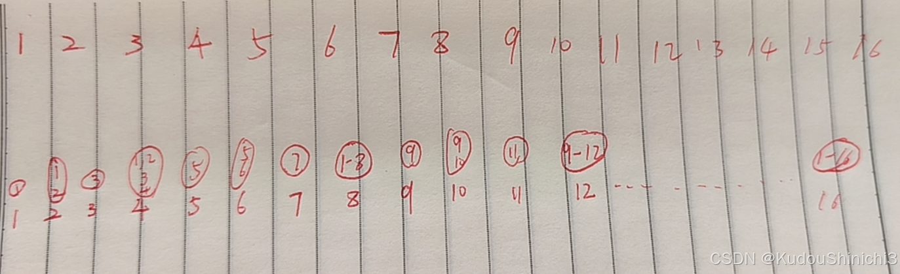
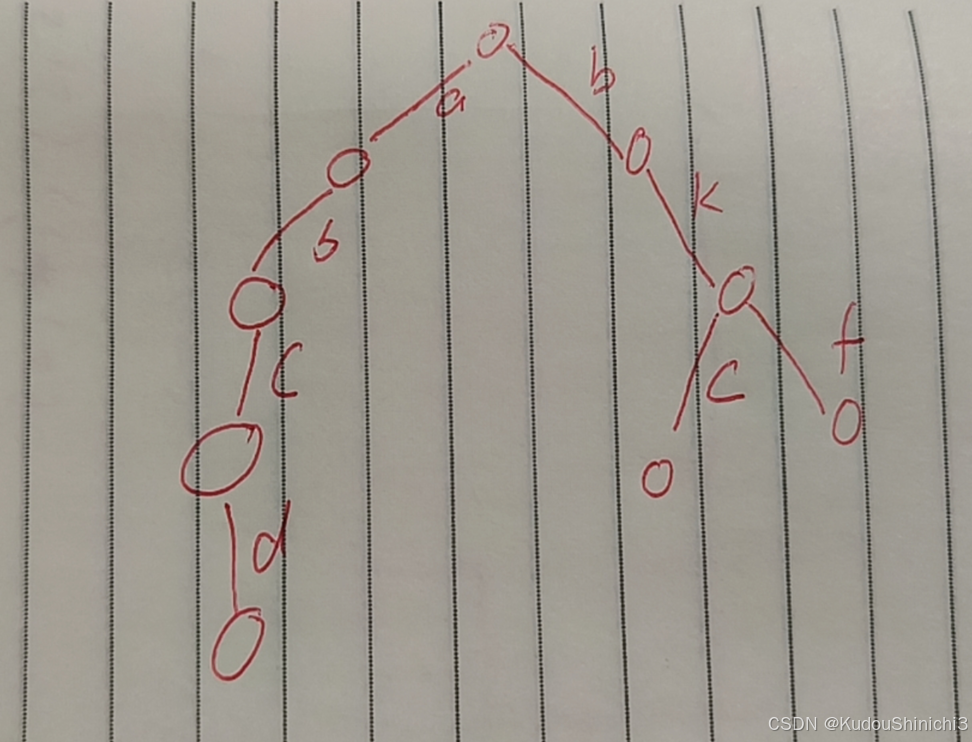
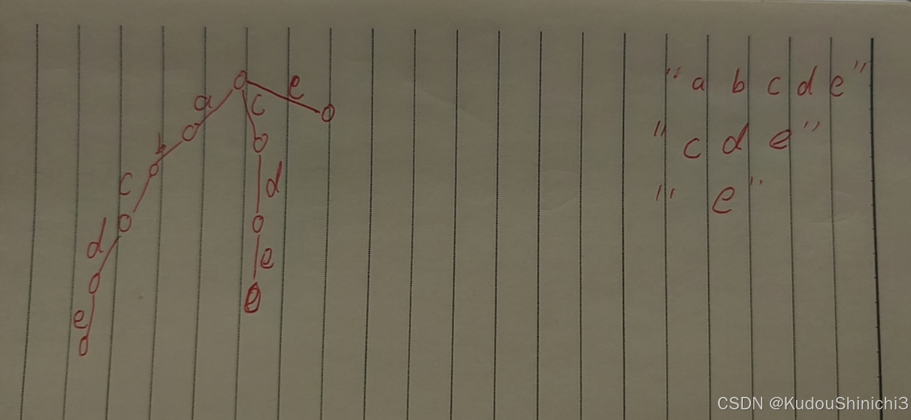
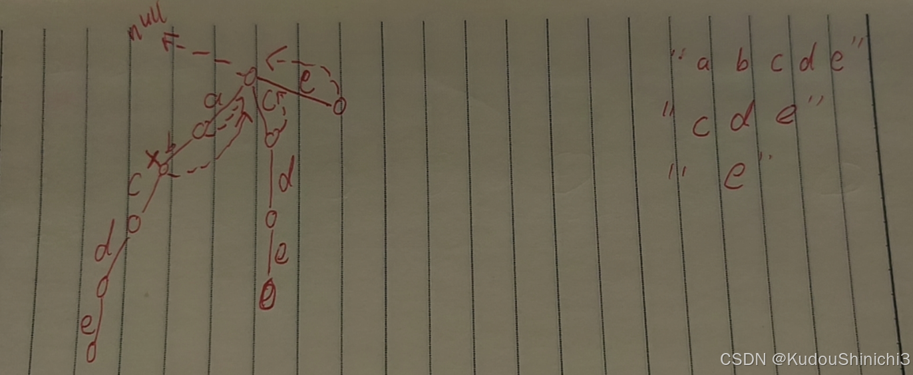
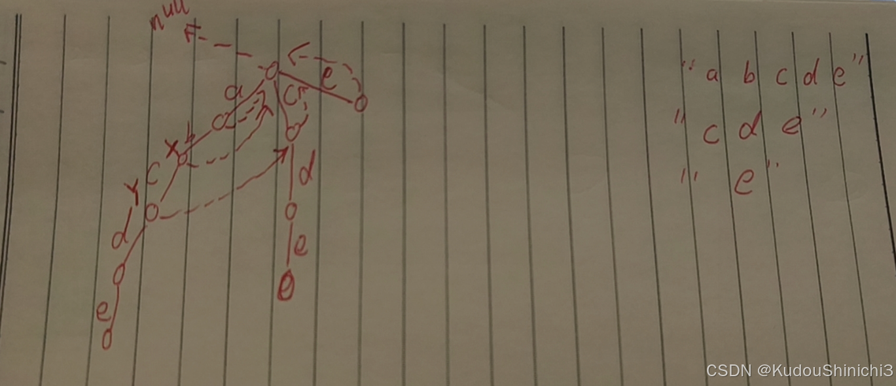
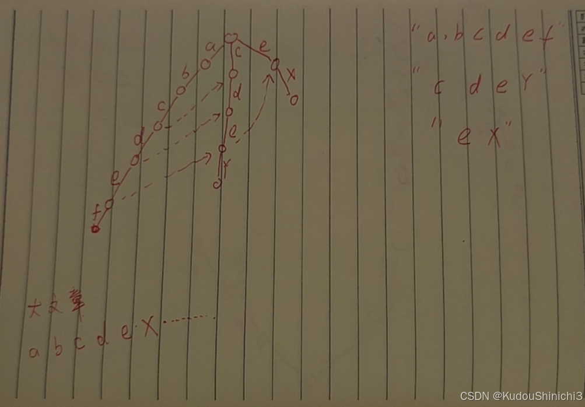

# [IndexTree、AC自动机](https://www.bilibili.com/video/BV1JuvYezEKx)

一、引言。

IndexTree和线段树有一些联系，这里我们再重新解释一下线段树用来解决什么样的一个问题，线段树解决的是一个区间查询和区间更新的一个问题，比如说我有一个数组在 L....R 上统一加上V，或者在L.....R上，统一所有的值都变为7，第三个就是查询任何L.....R范围上的累加和。这就是我们线段树解决的问题，区间统一增加一个值，或区间统一刷新一个值，或区间查一个累加和出来，三者都能很快，多快呢，logN水平。这篇文章我们要讲IndexTree，你可以认为他解决的也是累加和问题。

二、IndexTree

先说一个最简单的例子，说有一个数组arr[3,2,5,7,6] 这里我们人为规定，下标从1开始。在这个array中，我想查询 任何L...R位置的一个累加和，我们该怎么做，一般的做法呢，是我们生成一个前缀和数组，比如，上述数组的前缀和数组为help[3,5,10,17,23]。什么是前缀和数组呢，help 1 位置代表array中 1-1 位置累加和  help 2位置代表array中 1-2 位置累加和 等。由前缀和数组，我们可以获取到任意区间的累加和，假如说我们要获取3-4位置的累加和，我们只需要用 1-4 位置的累加和减去 1-2 位置的累加和。这个结构已经足够好了，但是，它有一个点很麻烦，就是，这个array中，你如果修改一个数，那么，这个累加和数组就需要重新生成。前缀和数组需要保证array不会改变。也就是说我想实现哪两个功能，第一个功能，我想改变一个单点的值，第二个功能，我还是想非常快的查 L....R 上的累加和。那么，上面那种结构，就不适用了，因为你一个新功能的出现，会导致help大量的更新，你还不如 L...R 每次都算一遍呢？所以，我们就需要换一个结构，同时支持这两个方法。那么这个结构是啥呢，就是 IndexTree， 可能有的小伙伴已经注意到了，这两个功能不是在线段树中已经被完美实现了吗？但是 indexTree 有比线段树更优的地方。IndexTree不能解决的是从 L...R 统一变成一个值，但是，它解决单点更新问题，再求累加和，他是非常快的。

三、IndexTree的一些规则

比如说我有一个数组 下标从 1 开始。arr[3 1  -2  3 6 0 9] 我想生成一个辅助数组，这个辅助数组我们也叫help，help 1 位置，就管 arr 1位置的3，help 2 位置呢，管 arr 1和 2 位置， 4，3位置呢，管它自己  -2，4位置呢，管 arr 1-4 位置 ，为5， 总结起来，就是 位置 i 看它前面有没有和 i能凑成一对的，如果有，就加起来，比如 2 位置就是前面一个1 和它本身的1  而4 位置就是1-2 管了2个位置，3-4 也管了两个位置，所以 4 位置是1-4位置的和，同理，6位置管 5 和 6 而8位置 管 1-8位置。



四、规律：
1. 假设某一个index = 010111000 这个index 管了哪些值？

   把最后一个1变成0 在 加上 1 这个数，一致管到它自己。这个例子说管的范围就是 010110001-010111000。举个例子，help 8 位置的数，我们从上图可知，help 8 位置管的是 1-8 位置的数，而8 的二进制为 01000 而它管的范围是 00001- 01000， 是不是 1-8。

2. 求1-i位置的前缀和，比如说i = 33，我们怎么求，33二进制为 0100001，当我想求 1-33所有的前缀和，我们先把他自己在help的位置累加上，然后，我们再剥掉最后面的 1 然后再累加上，就是1-33位置的累加和。为啥，因为33位置只管它自己，而把最后的1剥掉后，就是0100000，是32位置，而 1-32位置的累加和都在 32 位置。再举个例子，0101100110，这个位置，我们先拿原位置，然后加上把最后一个1抹去的下一个位置，然后再抹一个1，一直到没有1可以抹去。累加起来。

五、代码实现。

```csharp
public class IndexTree {
    // 下标从1开始！
    public static class IndexTree {

        private int[] tree;
        private int N;

        // 0位置弃而不用！
        public IndexTree(int size) {
            N = size;
            tree = new int[N + 1];
        }

        // 1~index 累加和是多少？
        public int sum(int index) {
            int ret = 0;
            while (index > 0) {
                ret += tree[index];
                index -= index & -index;
            }
            return ret;
        }

        // index & -index : 提取出index最右侧的1出来
        // index :           0011001000
        // index & -index :  0000001000
        public void add(int index, int d) {
            while (index <= N) {
                tree[index] += d;
                index += index & -index;
            }
        }
    }

    public static class Right {
        private int[] nums;
        private int N;

        public Right(int size) {
            N = size + 1;
            nums = new int[N + 1];
        }

        public int sum(int index) {
            int ret = 0;
            for (int i = 1; i <= index; i++) {
                ret += nums[i];
            }
            return ret;
        }

        public void add(int index, int d) {
            nums[index] += d;
        }

    }

    public static void main(String[] args) {
        int N = 100;
        int V = 100;
        int testTime = 2000000;
        IndexTree tree = new IndexTree(N);
        Right test = new Right(N);
        System.out.println("test begin");
        for (int i = 0; i < testTime; i++) {
            int index = (int) (Math.random() * N) + 1;
            if (Math.random() <= 0.5) {
                int add = (int) (Math.random() * V);
                tree.add(index, add);
                test.add(index, add);
            } else {
                if (tree.sum(index) != test.sum(index)) {
                    System.out.println("Oops!");
                }
            }
        }
        System.out.println("test finish");
    }
}
这里面，我们0位置弃而不用，要求下标从1开始，为啥，因为我们这些巧妙的下标换算，都是从1开始，我们如果强行从0开始的话，我们需要重新推导出没有这么方便的系统来。
```

我们再看add方法，我们假如说 3 位置有一个 7，那么我们要看help位置那些要跟着变动对不对，我们假设help数组有 1-12个下标，那 3位置变化，首先help本身3位置要变，然后还有4位置要变，然后还有8位置要变，而这个关系怎么推，就有意思了，3的二进制是 011 我把最右侧的1再加一遍，我就知道下一个受牵连的是谁了  例如 011 + 001 = 100  是 4位置，然后再把最右侧的1再加一遍，就是下一个受牵连的位置 100 + 100 = 1000  是 8 位置，再加一遍 1000+1000 = 10000  是 16位置。

有的小伙伴就不明白了，这些用线段树完全可以做啊， 时间复杂度也是logN啊，为啥要用indexTree呢，答案是线段树是一维的，如果要推到二维，老麻烦了，而IndexTree 要推到二维，可是非常的容易。

二维IndexTree：

二维IndexTree可以做到什么呢，二维IndexTree可以做到从原位置 1，1到i，j 这一整块累加和这个值，填在 i，j  这个格子里。也就是说还是面临一个问题，就是当我某一个位置的值变了之后，我help影响的位置可能相当的多。假设原数组0110100行  0111000列位置的数变了，那么，help中，

0110001 - 0110100行  到  0110001 列到 0111000列的数都要变。

二维code

```csharp
public class IndexTree2D {
    private int[][] tree;
    private int[][] nums;
    private int N;
    private int M;
    public Code02_IndexTree2D(int[][] matrix) {
        if (matrix.length == 0 || matrix[0].length == 0) {
            return;
        }
        N = matrix.length;
        M = matrix[0].length;
        tree = new int[N + 1][M + 1];
        nums = new int[N][M];
        for (int i = 0; i < N; i++) {
            for (int j = 0; j < M; j++) {
                update(i, j, matrix[i][j]);
            }
        }
    }

    private int sum(int row, int col) {
        int sum = 0;
        for (int i = row + 1; i > 0; i -= i & (-i)) {
            for (int j = col + 1; j > 0; j -= j & (-j)) {
                sum += tree[i][j];
            }
        }
        return sum;
    }

    public void update(int row, int col, int val) {
        if (N == 0 || M == 0) {
            return;
        }
        int add = val - nums[row][col];
        nums[row][col] = val;
        for (int i = row + 1; i <= N; i += i & (-i)) {
            for (int j = col + 1; j <= M; j += j & (-j)) {
                tree[i][j] += add;
            }
        }
    }

    public int sumRegion(int row1, int col1, int row2, int col2) {
        if (N == 0 || M == 0) {
            return 0;
        }
        return sum(row2, col2) + sum(row1 - 1, col1 - 1) - sum(row1 - 1, col2) - sum(row2, col1 - 1);
    }
}
```


六、AC自动机
什么叫AC自动机，在说AC自动机之前，我们先回顾一下什么叫KMP，KMP是说有一个字符串str1，还有一个字符串叫str2，判断str2是不是str1的子串，并且返回子串最初开头的位置，那么AC自动机将的是什么呢，讲的是假如说你有一个小的词典，这里面放着若干个敏感词，同时你有一篇大文章，小词典有若干敏感词，相当于一个str数组嘛，大文章就是一个大String，所谓AC自动机指的是大文章中每一个敏感词你都给我收集到，不能漏掉。这就是AC自动机。我们先不盯大文章，先把目光放在若干敏感词上，假如说有这么些敏感词，“abc”，“bkf”，“abcd” ，“bkc ”首先这若干个敏感词给建成前缀树。如下图。



所谓的AC自动机，就是在前缀树的基础上做升级，我们再换一个例子。



我们的节点，除了往下走的路之外，是没有指针的，现在加一个指针，指针的名字叫fial指针，那么就有问题了，我给每一个节点都加一fail指针的话，我们怎么设置这个fail指针。

1. 前缀树头节点的fail指针一律指向null，头节点往下一级的节点，fail指针一律指向头部。再往下按照树的宽度遍历设置fail指针。那第二级fail指针要怎么指呢，我们定义第二级第一个节点为x，x的父节点的fail指针，指向谁，头节点对不对，所以我就考察父亲到x  b这条路，看头节点有没有指向b的路，没有，于是再往下问，头的fail指针指向的是空，null当然没有指向b的路，x的fail指针直接指向头节点。如下图



接下来我们看一个能跳出的例子。

现在X下面的那个节点，我们称之为Y节点，Y的父节点是X，X的fail指针指向的是头结点，那么头结点有没有指向C的路呢，有，所以Y的fail指针就指向这个有的。如下图



AC自动机实质。

一个敏感词中，摸一个字我匹配失败了，其他敏感词的前缀，必须和我这个匹配失败的这个后缀一致。

这个fail指针干啥用的。



首先，问大文章中有那些敏感词，从头部开始，顺着往下走，有没有走向a的路，有，有没有走向b的路，有，有没有走向c的路，有，有没有走向d的路，有，有没有走向e的路，有，继续走，有没有走向x的路，没了，我只有走向f的路，这说明什么，这说明大文章从0位置开头能够匹配出敏感词的努力失败，然后我们顺着e的指针来到第二条路的e为什么，我找寻的是必须以e结尾，最长的前缀保留，为什么要是最长前缀，因为我百分百确认 0 和 1 都不可能配出敏感词，我准确的跳到有可能配出敏感词的下一个最可能最近的位置。

七、AC自动机code


```csharp
import java.util.ArrayList;
import java.util.LinkedList;
import java.util.List;
import java.util.Queue;

public class AC2 {
    // 前缀树的节点
    public static class Node {
        // 如果一个node，end为空，不是结尾
        // 如果end不为空，表示这个点是某个字符串的结尾，end的值就是这个字符串
        public String end;
        // 只有在上面的end变量不为空的时候，endUse才有意义
        // 表示，这个字符串之前有没有加入过答案
        public boolean endUse;
        public Node fail;
        public Node[] nexts;

        public Node() {
            endUse = false;
            end = null;
            fail = null;
            nexts = new Node[26];
        }
    }

    public static class ACAutomation {
        private Node root;

        public ACAutomation() {
            root = new Node();
        }

        public void insert(String s) {
            char[] str = s.toCharArray();
            Node cur = root;
            int index = 0;
            for (int i = 0; i < str.length; i++) {
                index = str[i] - 'a';
                if (cur.nexts[index] == null) {
                    cur.nexts[index] = new Node();
                }
                cur = cur.nexts[index];
            }
            cur.end = s;
        }

        public void build() {
            Queue<Node> queue = new LinkedList<>();
            queue.add(root);
            Node cur = null;
            Node cfail = null;
            while (!queue.isEmpty()) {
                // 某个父亲，cur
                cur = queue.poll();
                for (int i = 0; i < 26; i++) { // 所有的路
                    // cur -> 父亲  i号儿子，必须把i号儿子的fail指针设置好！
                    if (cur.nexts[i] != null) { // 如果真的有i号儿子
                        cur.nexts[i].fail = root;
                        cfail = cur.fail;
                        while (cfail != null) {
                            if (cfail.nexts[i] != null) {
                                cur.nexts[i].fail = cfail.nexts[i];
                                break;
                            }
                            cfail = cfail.fail;
                        }
                        queue.add(cur.nexts[i]);
                    }
                }
            }
        }

        // 大文章：content
        public List<String> containWords(String content) {
            char[] str = content.toCharArray();
            Node cur = root;
            Node follow = null;
            int index = 0;
            List<String> ans = new ArrayList<>();
            for (int i = 0; i < str.length; i++) {
                index = str[i] - 'a'; // 路
                // 如果当前字符在这条路上没配出来，就随着fail方向走向下条路径
                while (cur.nexts[index] == null && cur != root) {
                    cur = cur.fail;
                }
                // 1) 现在来到的路径，是可以继续匹配的
                // 2) 现在来到的节点，就是前缀树的根节点
                cur = cur.nexts[index] != null ? cur.nexts[index] : root;
                follow = cur;
                while (follow != root) {
                    if (follow.endUse) {
                        break;
                    }
                    // 不同的需求，在这一段之间修改
                    if (follow.end != null) {
                        ans.add(follow.end);
                        follow.endUse = true;
                    }
                    // 不同的需求，在这一段之间修改
                    follow = follow.fail;
                }
            }
            return ans;
        }

    }

    public static void main(String[] args) {
        ACAutomation ac = new ACAutomation();
        ac.insert("dhe");
        ac.insert("he");
        ac.insert("abcdheks");
        // 设置fail指针
        ac.build();

        List<String> contains = ac.containWords("abcdhekskdjfafhasldkflskdjhwqaeruv");
        for (String word : contains) {
            System.out.println(word);
        }
    }
}
```

