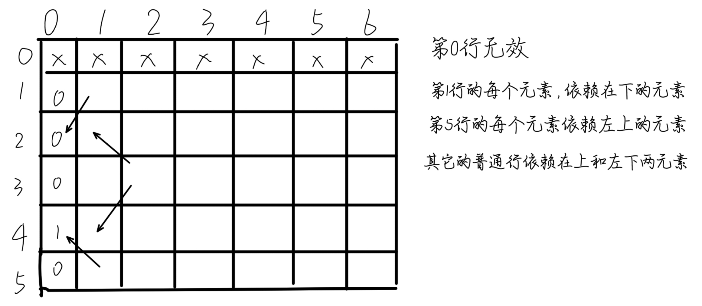
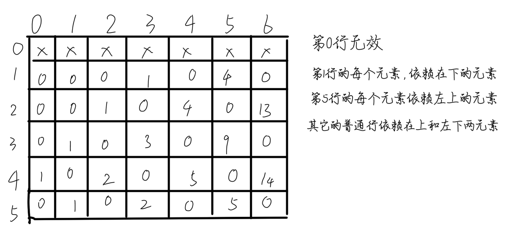
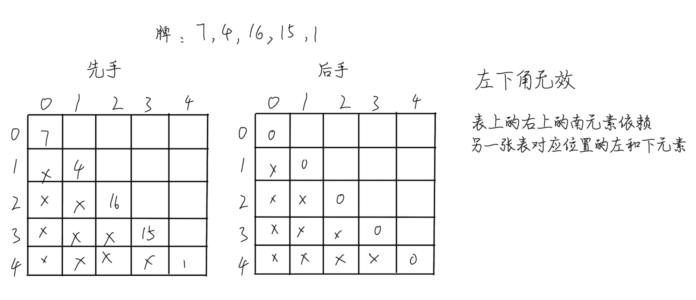

# [从暴力递归到动态规划1](https://www.bilibili.com/video/BV1WfvaejEQ3)

### 动态规划

什么是动态规划？用之前的子过程的结果可以加速计算

## 从暴力递归到动态规划

### 问题一：机器人行走问题

题目：假设有排成一行的N个位置，记为1~N，N 一定大于或等于 2。开始时机器人在其中的M位置上(M 一定是 1~N 中的一个)，如果机器人来到1位置，那么下一步只能往右来到2位置；如果机器人来到N位置，那么下一步只能往左来到 N-1 位置；如果机器人来到中间位置，那么下一步可以往左走或者往右走；规定机器人必须走 K 步，最终能来到P位置(P也是1~N中的一个)的方法有多少种？（给定四个参数 N、M、K、P，返回方法数) 

**阶段一：使用暴力递归求解问题**

朴实无华的暴力递归

```csharp
private static int Ways1(int n, int start, int target, int k)
{
    if (n < 2 || start < 1 || start > n || target < 1 || target > n || k < 1) return -1;

    return Process1(start, k, target, n);
}

// 机器人当前来到的位置是cur，
// 机器人还有rest步需要去走，
// 最终的目标是aim，
// 有哪些位置？1~N
// 返回：机器人从cur出发，走过rest步之后，最终停在aim的方案数，是多少？
private static int Process1(int cur, int rest, int target, int n)
{
    if (rest == 0)
        // 如果已经不需要走了，走完了！
        return cur == target ? 1 : 0;

    // (cur, rest)
    if (cur == 1)
        // 1 -> 2
        return Process1(2, rest - 1, target, n);

    // (cur, rest)
    if (cur == n)
        // N-1 <- N
        return Process1(n - 1, rest - 1, target, n);

    // (cur, rest)
    return Process1(cur - 1, rest - 1, target, n) + Process1(cur + 1, rest - 1, target, n);
}
```

**阶段二：使用表结构查询之前的运算结果**

把计算过的结果保存起来，再次遇到时直接拿结果。重要的是分析那些变量的变量影响了结果或者产生了新的结果

```csharp
private static int Ways2(int n, int start, int target, int k)
{
    if (n < 2 || start < 1 || start > n || target < 1 || target > n || k < 1) return -1;

    var dp = new int[n + 1, k + 1];
    for (var i = 0; i <= n; i++)
        for (var j = 0; j <= k; j++)
            dp[i, j] = -1;

    // dp就是缓存表
    // dp[cur,rest] == -1 -> process1(cur, rest)之前没算过！
    // dp[cur,rest] != -1 -> process1(cur, rest)之前算过！返回值，dp[cur,rest]
    // N+1 * K+1
    return Process2(start, k, target, n, dp);
}

// cur 范围: 1 ~ N
// rest 范围：0 ~ K
private static int Process2(int cur, int rest, int target, int n, int[,] dp)
{
    if (dp[cur, rest] != -1) return dp[cur, rest];//之前算过，直接返回

    // 之前没算过！
    int ans;
    if (rest == 0)
        ans = cur == target ? 1 : 0;
    else if (cur == 1)
        ans = Process2(2, rest - 1, target, n, dp);
    else if (cur == n)
        ans = Process2(n - 1, rest - 1, target, n, dp);
    else
        ans = Process2(cur - 1, rest - 1, target, n, dp) + Process2(cur + 1, rest - 1, target, n, dp);

    dp[cur, rest] = ans;//保存结果到缓存中
    return ans;
}
```

**阶段三：动态规划：初始化表；根据暴力递归的思路填充表格。同时注意区分填表时的一般情况和特殊情况；返回从标准查询给定参数在表中对应的结果**

行表示格子的位置，列表示还有多少步要走。假设机器人开始在2位置，它的目标是4位置，还有6步要走，我们可以找到这样的规律：



将表填充完整



将这个过程转化为代码。也就找规律，把表填充完整，最后直接返回表中符合条件的答案

```csharp
private static int Ways3(int n, int start, int target, int k)
{
    if (n < 2 || start < 1 || start > n || target < 1 || target > n || k < 1) return -1;

    var dp = new int[n + 1, k + 1]; //行为各个位置，列为剩余步数
    //在目标位置时，向目标位置移动的距离是1，其他位置不是目标位置，所以设置为0，第一列设置完成
    dp[target, 0] = 1;

    //数组遍历方式为先列后行
    for (var rest = 1; rest <= k; rest++)
    {
        // 第"0"列的代码无需处理
        dp[1, rest] = dp[2, rest - 1]; //第"1"列的元素依赖它的左下元素
        for (var cur = 2; cur < n; cur++) //普遍情况下
            dp[cur, rest] = dp[cur - 1, rest - 1] + dp[cur + 1, rest - 1]; //作为普遍情况下的中间部分的结果依赖左上和右上元素
        dp[n, rest] = dp[n - 1, rest - 1]; //第"n"列的元素依赖它的左上元素
    }

    return dp[start, k];
}
```

重点是理解填表的过程

### 问题二：轮流抽牌问题

题目：给定一个整型数组arr，代表数值不同的纸牌排成一条线，玩家A和玩家B依次拿走每张纸牌，规定玩家A先拿，玩家B后拿， 但是每个玩家每次只能拿走最左或最右的纸牌，玩家A和玩家B都绝顶聪明。请返回最后获胜者的分数。

思路：和上题基本是相似的，通过具体的例子以及递归调用参考总结格子的依赖。查看方法2，理解在这个案例中如何使用缓存

**假设一个具体的例子来填表**：

