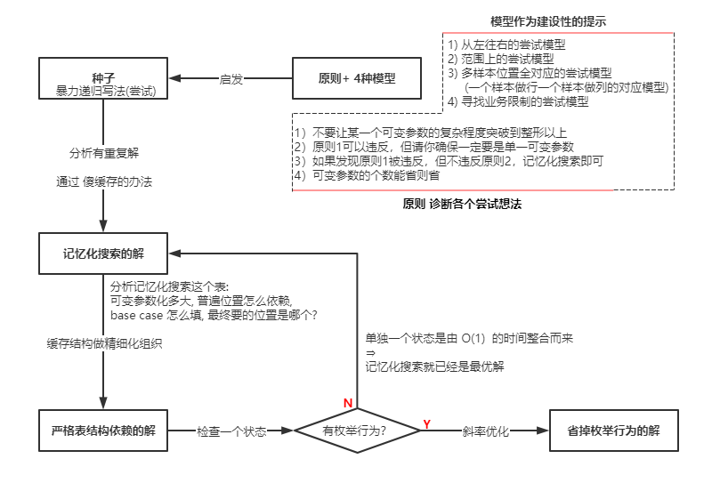

# [从暴力递归到动态规划6](https://www.bilibili.com/video/BV1K9vaeSEvX)

### 题目1: 正数数组分割为累加和接近的两个集合

### 题目2: 正数数组分割为个数跟累加和接近的两个集合

## 暴力递归到动态规划的大总结

## 什么暴力递归可以继续优化？

有重复调用同一个子问题的解，这种递归可以优化

如果每一个子问题都是不同的解，无法优化也不用优化

## 暴力递归和动态规划的关系

某一个暴力递归，有解的重复调用，就可以把这个暴力递归优化成动态规划

任何动态规划问题，都一定对应着某一个有解的重复调用的暴力递归

但不是所有的暴力递归，都一定对应着动态规划

## 面试题和动态规划的关系
解决一个问题，可能有很多尝试方法

可能在很多尝试方法中，又有若干个尝试方法有动态规划的方式

一个问题   可能有   若干种动态规划的解法

## 如何找到某个问题的动态规划方式？

1. 设计暴力递归：重要原则+4种常见尝试模型！重点！
2. 分析有没有重复解：套路解决
3. 用记忆化搜索 -> 用严格表结构实现动态规划：套路解决
4. 看看能否继续优化：套路解决

## 面试中设计暴力递归过程的原则

1. 每一个可变参数的类型，一定不要比int类型更加复杂
2. 原则1可以违反，让类型突破到一维线性结构，那必须是单一可变参数
3. 如果发现原则1被违反，但不违反原则2，只需要做到记忆化搜索即可
4. 可变参数的个数，能少则少

## 知道了面试中设计暴力递归过程的原则，然后呢？
一定要逼自己找到不违反原则情况下的暴力尝试！

如果你找到的暴力尝试，不符合原则，马上舍弃！找新的！

如果某个题目突破了设计原则，一定极难极难，面试中出现概率低于5%！

## 常见的4种尝试模型

1. 从左往右的尝试模型
2. 范围上的尝试模型
3. 多样本位置全对应的尝试模型/样本对应模型
4. 寻找业务限制的尝试模型

## 如何分析有没有重复解

列出调用过程，可以只列出前几层

有没有重复解，一看便知

## 暴力递归到动态规划的套路

1. 你已经有了一个不违反原则的暴力递归，而且的确存在解的重复调用  
2. 找到哪些参数的变化会影响返回值，对每一个列出变化范围  
3. 参数间的所有的组合数量，意味着表大小  
4. 记忆化搜索的方法就是傻缓存，非常容易得到  
5. 规定好严格表的大小，分析位置的依赖顺序，然后从基础填写到最终解  
6. 对于有枚举行为的决策过程，进一步优化  

## 动态规划的进一步优化

1. 空间压缩
2. 状态化简
3. 动态规划中的四边形不等式优化

其他优化技巧略

题目3: N皇后问题

不能改动态规划, 只能暴力