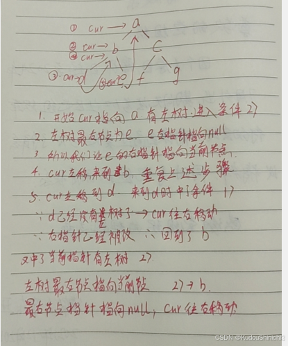

# [Morris遍历](https://www.bilibili.com/video/BV1JuvYezEAa)

一、什么是Morris遍历?
在介绍啊Morris遍历之前，先提一嘴二叉树的遍历，先序，中序，后续，相信大家都写过。

```csharp
public class Node{
    public int value;
    Node left;
    Node right;

    public Node(int data){
        this.Value = data;
    }
}

public static void Process(Node root){
    if(root != null){
        return;
    }
    //1
    Process(root.left);
    //2
    Process(root.right);
    //3
}
```

我们如果把打印行为，放在 1 位置，就是先序遍历，放在2位置就是中序遍历，放在3位置就是后序遍历。相信大家经常这样写。这种方式，对于一个节点，会回到三次，所以二叉树的遍历时间复杂度为O(n),这个n是什么，二叉树节点的个数，用这种方式实现二叉树遍历，额外空间复杂度是多少，对是二叉树高度。为啥，因为我们使用的是递归实现二叉树遍历，而递归，是因为系统缘故，做了压栈的操作，那么对于算法来讲，不管是系统帮我们实现的，还是我们申请的，是不是都要占额外空间呀，所以递归方法占用多少空间，最坏情况下是这棵树有多高，就要占用多少时间，因为你得把线索记录，你才能回去吧。相信大家都了解过，实现二叉树的遍历，未必用递归方法，可以用非递归方法，你用非递归方法，就是说你不用系统栈帮你做，改成迭代了，那我们是不是也得自己申请栈，把一个一个节点压进去呀，只不过这个栈是我们自己申请的。说了这么久，该引出我们的Morris遍历了，Morris遍历，实现二叉树遍历，可以帮我们省掉那个栈，使我们遍历二叉树时间复杂度为O（N），空间复杂度为O（1），所以Morris遍历真正优化的是空间。怎么做到额外空间O（1） 还能保证时间复杂度依然为O（N）就是Morris遍历的精髓。

二、Morris遍历怎么做到的
它利用了一棵树上大量的右指针空闲空间，啥意思，例如下面一棵树

```csharp
                                        a
                                       / \
                                      b   c
```
节点a左右都不空闲，但是b的左右两个指针，他其实占空间了但它没用，c的两个同样也是，因为最底层指向的其实是空，对不对，一棵树，有大量的空闲空间，你不用，他就浪费了呀，Morris遍历利用的就是我这颗树自带的，你没有利用起来的空间帮你完成的遍历。

三、Morris遍历细节

```csharp
// 假设来到当前节点cur，开始时cur来到头节点位置 
//    1）如果cur没有左孩子，cur向右移动(cur = cur.right) 
//    2）如果cur有左孩子，找到左子树上最右的节点mostRight：    
//          a.如果mostRight的右指针指向空，让其指向cur，     
//          然后cur向左移动(cur = cur.left)     
//          b.如果mostRight的右指针指向cur，让其指向null，    
//          然后cur向右移动(cur = cur.right) 3）cur为空时遍历停止
```


例如：



Morris遍历顺序：

a,b,d,b,e,a,c,f,c,g

所以这个序叫做Morris序，这个序有什么特点，任何节点，只要有左树，会来到两次，而且是遍历完左树之后，第二次回到这个节点。如果没有左树，只会到一次。

这个流程的实质是，我在用左树最又节点的右指针状态，来标记我到底是第一次到的这个节点，还是第二次。这就是实质。

四、Morris遍历有什么用？
你想象一下啊，现在大家大部分都是web编程，内存越来越便宜了，所以说，你遍历一棵树，多用一些空间怎么了，确实没怎么，如果你在一个内存吃紧的空间上，比如你是玩嵌入式编程的，你是玩系统编程的程序员，所有的代码都是要在你这个系统上跑的，越底层的东西，是不是要求越高效，是不是要求越省空间，如果只要牵扯到遍历，就要额外空间，给他一个高度的空间来玩一遍，那我实现的系统不需要，我比你更省空间，你说哪一个系统大家更爱用，内存就那么大，系统用的多了，留给应用的就少了，越底层的东西，就越要求高效，越要求时间做的完美的情况下，空间也尽量要少。

那有的人就说了，你给我一个Morris序，我不要Morris序，Morris序是什么鬼玩意，老子要的是先序中序和后续， 比如上面那棵树，你给我一个Morris序，谁认啊。

Morris序： a,b,d,b,e,a,c,f,c,g

通过Morris序加工出先序：

对于能回到自己两次的节点，你在第一次到就处理，对于只会到达自己一次的节点，直接处理，就是先序。

通过Morris序加工出中序：

对于能回到自己两次的节点，你在第二次到处理，对于只会到达自己一次的节点，直接处理，就是中序。

通过Morris序加工出后序：

1.我们把处理时机只放在能回到自己两次的节点，且第二次回到的时候。

在我们第二次回到该节点时，我们不打印他自己，我们逆序打印它左树的右边界。Morris跑完之后，单独打印整棵树的逆序右边界。

怎么打印一棵树逆序右边界  不能用栈，为啥，因为我们使用Morris遍历就是为了省那么点空间，现在如果因为打印逆序右边界而使用栈，那么我们用Morris遍历图啥，直接递归不就好了嘛，那怎么做呢？  链表反转。

五、Coding

```csharp
public class MorrisTraversal {
    public static class Node {
        public int value;
        Node left;
        Node right;

        public Node(int data) {
            this.value = data;
        }
    }

    public static void process(Node root) {
        if (root == null) {
            return;
        }
        // 1
        process(root.left);
        // 2
        process(root.right);
        // 3
    }

    public static void morris(Node head) {
        if (head == null) {
            return;
        }
        Node cur = head;
        Node mostRight = null;
        while (cur != null) {
            mostRight = cur.left;
            if (mostRight != null) {
                while (mostRight.right != null && mostRight.right != cur) {
                    mostRight = mostRight.right;
                }
                if (mostRight.right == null) {
                    mostRight.right = cur;
                    cur = cur.left;
                    continue;
                } else {
                    mostRight.right = null;
                }
            }
            cur = cur.right;
        }
    }

    public static void morrisPre(Node head) {
        if (head == null) {
            return;
        }
        Node cur = head;
        Node mostRight = null;
        while (cur != null) {
            mostRight = cur.left;
            if (mostRight != null) {
                while (mostRight.right != null && mostRight.right != cur) {
                    mostRight = mostRight.right;
                }
                if (mostRight.right == null) {
                    System.out.print(cur.value + " ");
                    mostRight.right = cur;
                    cur = cur.left;
                    continue;
                } else {
                    mostRight.right = null;
                }
            } else {
                System.out.print(cur.value + " ");
            }
            cur = cur.right;
        }
        System.out.println();
    }

    public static void morrisIn(Node head) {
        if (head == null) {
            return;
        }
        Node cur = head;
        Node mostRight = null;
        while (cur != null) {
            mostRight = cur.left;
            if (mostRight != null) {
                while (mostRight.right != null && mostRight.right != cur) {
                    mostRight = mostRight.right;
                }
                if (mostRight.right == null) {
                    mostRight.right = cur;
                    cur = cur.left;
                    continue;
                } else {
                    mostRight.right = null;
                }
            }
            System.out.print(cur.value + " ");
            cur = cur.right;
        }
        System.out.println();
    }

    public static void morrisPos(Node head) {
        if (head == null) {
            return;
        }
        Node cur = head;
        Node mostRight = null;
        while (cur != null) {
            mostRight = cur.left;
            if (mostRight != null) {
                while (mostRight.right != null && mostRight.right != cur) {
                    mostRight = mostRight.right;
                }
                if (mostRight.right == null) {
                    mostRight.right = cur;
                    cur = cur.left;
                    continue;
                } else {
                    mostRight.right = null;
                    printEdge(cur.left);
                }
            }
            cur = cur.right;
        }
        printEdge(head);
        System.out.println();
    }

    public static void printEdge(Node head) {
        Node tail = reverseEdge(head);
        Node cur = tail;
        while (cur != null) {
            System.out.print(cur.value + " ");
            cur = cur.right;
        }
        reverseEdge(tail);
    }

    public static Node reverseEdge(Node from) {
        Node pre = null;
        Node next = null;
        while (from != null) {
            next = from.right;
            from.right = pre;
            pre = from;
            from = next;
        }
        return pre;
    }

    // for test -- print tree
    public static void printTree(Node head) {
        System.out.println("Binary Tree:");
        printInOrder(head, 0, "H", 17);
        System.out.println();
    }

    public static void printInOrder(Node head, int height, String to, int len) {
        if (head == null) {
            return;
        }
        printInOrder(head.right, height + 1, "v", len);
        String val = to + head.value + to;
        int lenM = val.length();
        int lenL = (len - lenM) / 2;
        int lenR = len - lenM - lenL;
        val = getSpace(lenL) + val + getSpace(lenR);
        System.out.println(getSpace(height * len) + val);
        printInOrder(head.left, height + 1, "^", len);
    }

    public static String getSpace(int num) {
        String space = " ";
        StringBuffer buf = new StringBuffer("");
        for (int i = 0; i < num; i++) {
            buf.append(space);
        }
        return buf.toString();
    }

    public static boolean isBST(Node head) {
        if (head == null) {
            return true;
        }
        Node cur = head;
        Node mostRight = null;
        Integer pre = null;
        boolean ans = true;
        while (cur != null) {
            mostRight = cur.left;
            if (mostRight != null) {
                while (mostRight.right != null && mostRight.right != cur) {
                    mostRight = mostRight.right;
                }
                if (mostRight.right == null) {
                    mostRight.right = cur;
                    cur = cur.left;
                    continue;
                } else {
                    mostRight.right = null;
                }
            }
            if (pre != null && pre >= cur.value) {
                ans = false;
            }
            pre = cur.value;
            cur = cur.right;
        }
        return ans;
    }

    public static void main(String[] args) {
        Node head = new Node(4);
        head.left = new Node(2);
        head.right = new Node(6);
        head.left.left = new Node(1);
        head.left.right = new Node(3);
        head.right.left = new Node(5);
        head.right.right = new Node(7);
        printTree(head);
        morrisIn(head);
        morrisPre(head);
        morrisPos(head);
        printTree(head);
    }
}
```


我们知道了Morris遍历之后，二叉树的题目有很多的最优解是以Morris遍历的改法为最优解的，因为它空间复杂度为O（1）。

我们看一个经典大烂题，怎么判断一棵树，是搜索二叉树，我们都知道二叉树中序的遍历结果是升序，就是搜索二叉树。之前怎么实现的，实现二叉树的中序遍历，收集一个链表，然后遍历这个链表是否是升序的，浪不浪费空间啊，现在使用Morris用两个变量遍历完了之后，每个节点在打印的时候无非就是把一个打印行为变成跟之前变量的对比行为嘛，搞定了。

接下来来看一道Morris遍历改写的题目

六、给定一棵二叉树的头节点head。求以head为头的树中，最小深度是多少？
简单分析一下：

深度就是头节点到叶节点的高度。这道题正规做法，就应该是二叉树的递归套路。不改Morris遍历的话，就是用递归来实现，这样的话就是时间复杂度O（n），空间复杂度，树的高度，如果能够改出Morris遍历的版本是不是意味着空间可以进一步优化。怎么改？

举个栗子：

```cs
                                      a
                                   /      \
                                 b          c
                               /  \           \
                             d      e            g
                                   /               \
                                  f                 h
                                                   /
                                                  i
```
上面这课树，a到d是一个深度3，a到f是一个深度4，a到i是一个深度5，因为只有三个叶节点，所以我们应该选择最小的那个 3。

我们怎么找到这个3呢？我们要想改Morris遍历，我们需要解决几个问题。

我们Morris遍历，是有一个current指针的，我们的current指针来到任何节点时，都需要解决一个问题，能不能搞定current来到任何一个节点，这个current节点在第几层的问题。就是说你current不管来到第几层，都得把一个变量更新对，这个变量叫做level，当current来到1的时候，这个level为1，当current来到b的时候，这个level为2，当current来到g的时候，这个level为3，这个level指的是当current来到任何一个节点时，这个current在第几层。

还有一个问题是，我们要可以正确发现叶节点，如果我们可以正确发现叶节点，这个问题我们就解决了，比如说我们正确发现d是叶节点，那么此时的level我记录一下，我用一个全局变量min记录一下。只要解决这俩问题，Morris遍历版本就改出来了。

容易吗？一点都不容易，难在哪，难在该指针这件事，我们自己改指针这件事就很烦了，为啥，假如说我上一个指针 X  在第七层，那么当前指针 Y在第几层，如果 Y 是 X的左孩子，那么 Y 一定在第八层，level可以正确更新，如果 右孩子是 Y 那么，就不一定了为啥，在Morris遍历中，如果右孩子为空，我们把指针指向了当前节点， 我们怎么知道这个 Y 是不是这么上去的。该怎么看，我们这么看，如果我们Y左树上的最右节点不是X 那我一定在第八层，如果我发现是X，我们要怎么得到正确的层数，我们需要数一下左树右边界有几个节点， 7 减去这个玩意，我们就更新出了Y该在的层数。这样level就正确更新出来了。

第二个问题，当来到一个位置时，我们怎么判断是不是原二叉树的叶节点，容易吗？不容易啊，为啥，因为我们再Morris中认为改过指针。当我们真的来到叶节点之后，它的右指针被我们改过了，所以我们判断不出来了。因为它右指针不是null了，我们怎么办，我们这么搞，对于能回到自己两次的节点，比如上面例子的 b  我们第二次回到 b 的时候，恢复之后，我们看看 d是不是叶子节点，我们是根据恢复之后再判断左树右边界是不是叶节点。最后单独检查整棵树的最右节点是不是叶节点。


```csharp
public class MinDepth {
public static class TreeNode {
	public int val;
	public TreeNode left;
	public TreeNode right;
 
	public TreeNode(int x) {
		val = x;
	}
}
 
// 下面的方法是一般解
public static int minDepth1(TreeNode head) {
	if (head == null) {
		return 0;
	}
	return p(head);
}
 
// 返回x为头的树，最小深度是多少
public static int p(TreeNode x) {
	if (x.left == null && x.right == null) {
		return 1;
	}
	// 左右子树起码有一个不为空
	int leftH = Integer.MAX_VALUE;
	if (x.left != null) {
		leftH = p(x.left);
	}
	int rightH = Integer.MAX_VALUE;
	if (x.right != null) {
		rightH = p(x.right);
	}
	return 1 + Math.min(leftH, rightH);
}
 
// 下面的方法是morris遍历的解
public static int minDepth2(TreeNode head) {
	if (head == null) {
		return 0;
	}
	TreeNode cur = head;
	TreeNode mostRight = null;
	int curLevel = 0;
	int minHeight = Integer.MAX_VALUE;
	while (cur != null) {
		mostRight = cur.left;
		if (mostRight != null) {
			int rightBoardSize = 1;
			while (mostRight.right != null && mostRight.right != cur) {
				rightBoardSize++;
				mostRight = mostRight.right;
			}
			if (mostRight.right == null) { // 第一次到达
				curLevel++;
				mostRight.right = cur;
				cur = cur.left;
				continue;
			} else { // 第二次到达
				if (mostRight.left == null) {
					minHeight = Math.min(minHeight, curLevel);
				}
				curLevel -= rightBoardSize;
				mostRight.right = null;
			}
		} else { // 只有一次到达
			curLevel++;
		}
		cur = cur.right;
	}
	int finalRight = 1;
	cur = head;
	while (cur.right != null) {
		finalRight++;
		cur = cur.right;
	}
	if (cur.left == null && cur.right == null) {
		minHeight = Math.min(minHeight, finalRight);
	}
	return minHeight;
}
}
```


到这里了要注意，不是所有题目都能用Morris遍历改出来的，那么什么样的题目不能用Morris遍历改出来呢，就是当你收集信息 X节点的整棵树你需要 收集一些信息，而这些信息需要你左树收集完所有信息，右树搜集完所有信息，才能整合出自己的信息的。就是你需要信息的强整合，左树完了，右树完了，我得有左树的完整信息，右树的完整信息，我才能知道以X为头的信息，如果是这么强的依赖，Morris就别想了，因为Morris回不到一个节点三次，它只能回到一个节点两次，如果是这种题目特征的，我们就只能用常规递归套路来写了。如果我们发现，一个题目不要求收集左树右树完整信息就能得出我的信息，Morris遍历就能改比如上面这一题，我们只用关心每一个树左树上的某一个叶节点能够被自己算出它正确的高度来，所有的叶节点都能够这么被发现，这事就能够解决，他不要求这个节点左树信息全，右树信息全，才能整合出自己的信息，Morris遍历就是最优解。